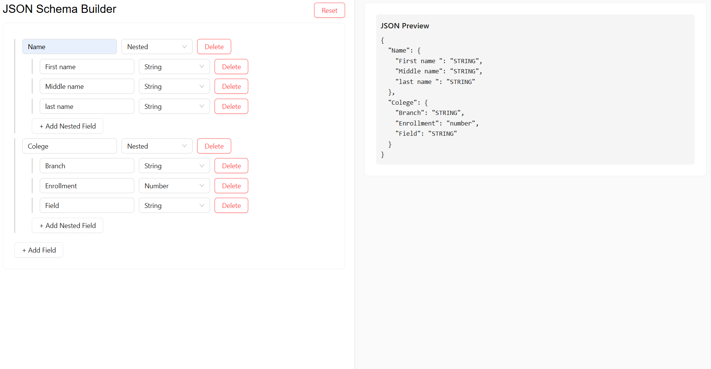

<div align="center">

# 🛠️ JSON Schema Builder

[](https://reactjs.org/)
[](LICENSE)
[]()

*A powerful React-based JSON Schema Builder for dynamic schema creation and visualization*

</div>

---

## ✨ Features

🔧 **Dynamic Field Management**
- Add, edit, and delete fields seamlessly
- Supports multiple types: `String`, `Number`, `Nested`, `Boolean`, `Object id`

🌳 **Nested Schema Support**
- Add unlimited recursive nested fields
- Intuitive hierarchical structure

⚡ **Live JSON Preview**
- Real-time updates as you edit
- Instant visual feedback

💾 **Persistent Storage**
- Auto-save to localStorage
- Schema remains after browser refresh

📱 **Responsive Design**
- Side-by-side builder and preview
- Optimized for better UX

🎁 **Bonus Features**
- One-click schema reset
- Copy JSON to clipboard *(Optional)*
- Download as `.json` file *(Optional)*

---

## 🏗️ Tech Stack

| Technology | Purpose |
|------------|---------|
| **React** | Frontend framework with hooks |
| **React Hook Form** | Form state management |
| **Ant Design** | UI components library |
| **JavaScript (ES6+)** | Core programming language |
| **LocalStorage** | Data persistence |

---

## 📁 Project Structure

```
src/
 ├── components/
 │    ├── Layout.jsx        # Two-column responsive layout
 │    ├── HeaderBar.jsx     # Header with Reset functionality
 │    ├── SchemaBuilder.jsx # Dynamic fields management logic
 │    ├── FieldRow.jsx      # Individual field with controls
 │    └── JsonPreview.jsx   # Live JSON schema preview
 ├── utils/
 │    └── generateSchema.js # Form state to JSON converter
 └── App.jsx                # Main application entry point
```

---

## 🚀 Quick Start

### 1️⃣ Clone Repository
```bash
git clone https://github.com/suman987654432/HROne-Frontend-Intern-Hiring-Task
cd json-schema-builder
```

### 2️⃣ Install Dependencies
```bash
npm install
```

### 3️⃣ Launch Application
```bash
npm start
```

🌐 **Application URL:** https://hr-one-frontend-intern-hiring-task.vercel.app/

---

## 📖 How to Use

1. **➕ Add Field** - Click the `+ Add Field` button to create new fields
2. **🔽 Select Type** - Choose from `String`, `Number`, or `Nested` field types
3. **🌳 Nested Fields** - For `Nested` type, use `+ Add Nested Field` for sub-fields
4. **👁️ Live Preview** - Watch your JSON schema update instantly in the right panel
5. **🔄 Persistence** - Refresh the page – your schema persists automatically!

---

## 📸 Preview





## 💡 Project Highlights

🎯 **Technical Demonstrations:**
- Advanced React state management with `react-hook-form`
- Complex recursive UI component structures
- Real-time data binding and synchronization
- Persistent storage implementation
- Clean, modular component architecture

---

## 📄 License

This project is licensed under the **MIT License** - see the [LICENSE](LICENSE) file for details.

---

<div align="center">

**⭐ Star this repo if you found it helpful!**

*Built with ❤️ using React & Ant Design*

</div>